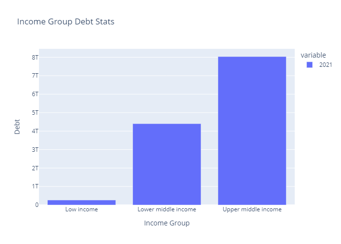
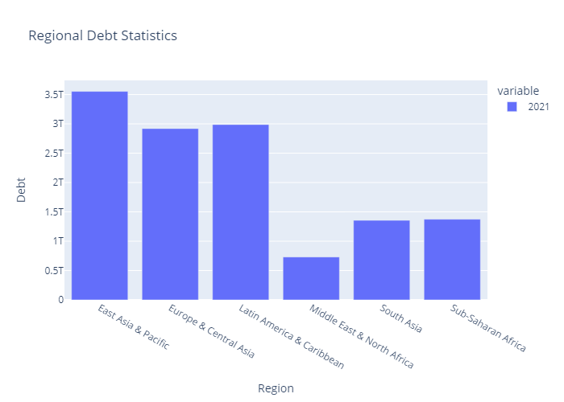
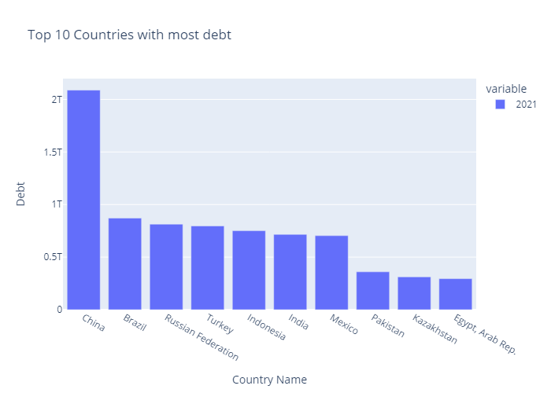

# International Debt Statistics
### by Himanshu Goswami

---------------------
## Introduction

It's not that we humans only take debts to manage our necessities. A country may also take debt to manage its economy. For example, infrastructure spending is one costly
ingredient required for a country's citizens to lead comfortable lives. The World Bank is the organization that provides debt to countries.

When debt is used appropriately, it can be used to foster the long-term growth and prosperity of a country. However, the national debt must be evaluated in an appropriate manner, such as comparing the amount of interest expense paid to other governmental expenditures or by comparing debt levels on a per capita basis.

------------------------

## DataSet Overview

- The dataset is taken from **[World Bank](https://datacatalog.worldbank.org/search/dataset/0038015)** official website and contains detailed statistics of debt, countries owes.
- The dataset is not entirely clean and hence little bit of data cleaning is carried out. For e.g. some rows weren't having any country name.
- Out of 136, only 122 are actual countries, other 14 are group of countries or just classification of countries on the basis of income level.
- There are couple of CSV files provided by World Bank, contained in **[IDS](IDS)** folder. Major file with debt statistics is **[IDS_ALLCountries_Data.csv](IDS/IDS_ALLCountries_Data.csv)** file and other files are for reference containing metadata.

-----------------------

## Analysis

***#1*** **Number of distinct countries** -> 122 countries made it to the list of World Bank

***#2*** **Number of distinct debt indicators** -> 556 is the number of Debt Indicators used by World Bank

***#3*** **Total bebt owed by the countries** -> 65 Trillion USD

***#4*** **Country with the highest debt** -> China. After cleaning the data & removing grouped countries from dataset, China tops the chart in World Bank dataset.

***#5*** **Average amount of debt across indicators** -> DT.AMT.DLXF.CD Indicator topped the chart.

***#6*** **Highest amount of principal repayment** -> 

***#7*** **Most common debt indicator** -> All Debt indicators are used for 136 times. Out of them DT.TDS.DEGG.CD occured the most.

--------------------

## Conclusion

- Countries categorized as **'Upper Middle Income'** are more in debt as compared to other categories - Low Income & Lower Middle Income.

- East Asia & Pacific regions are more in debt (Because of China mainly) followed by Europe & Central Asia. On the other hand, Middle East & North African countries are having least debt.

- Considering the top10 countries, China tops the chart, having debt more than 2nd and 3rd combined!

